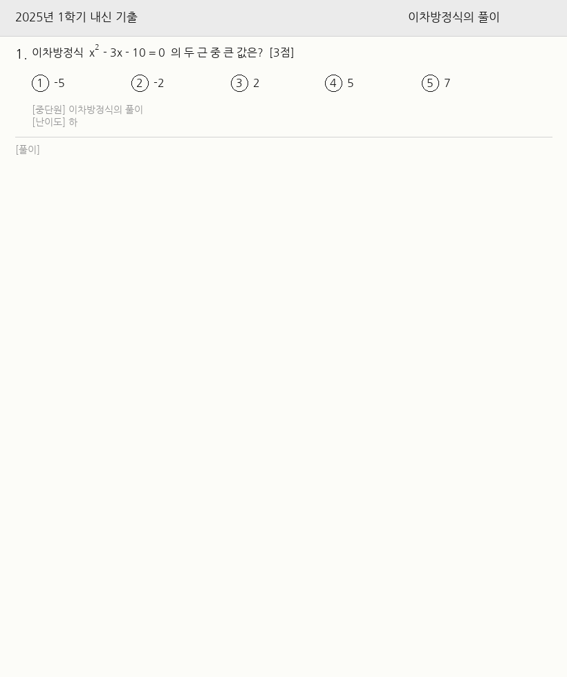
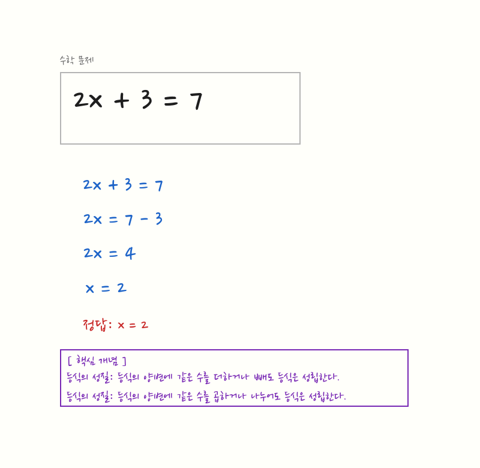

# math-handwriting-solver

수학 문제 사진 또는 PDF를 입력받아 **손글씨처럼 보이는 풀이**를 오버레이한 이미지/PDF를 출력하는 CLI 도구입니다.

Claude Vision으로 문제를 인식하고, Claude로 단계별 풀이를 생성한 뒤, PIL + NanumPenScript 폰트로 손떨림 jitter를 적용해 렌더링합니다.

---

## 예시

| 입력 | 출력 |
|------|------|
|  |  |

> 예시 이미지는 `docs/examples/`를 참고하세요.

---

## 설치

Python 3.11 이상, [NanumPenScript 폰트](https://hangeul.naver.com/font) 설치 필요.

```bash
git clone https://github.com/Je-hye/math-handwriting-solver.git
cd math-handwriting-solver
pip install -e .
```

의존 패키지: `anthropic`, `Pillow`, `pymupdf`, `sympy`

---

## 사용법

```bash
# Anthropic API 키 설정
export ANTHROPIC_API_KEY=<your-api-key>

# 이미지 또는 PDF 입력
python -m solver problem.jpg
python -m solver exam.pdf
```

출력 파일은 원본과 같은 디렉터리에 `{원본명}_solved.{확장자}`로 저장됩니다.

```
Processing: problem.jpg
Solved: problem_solved.jpg
```

신뢰도가 80% 미만이면 경고를 출력합니다:

```
⚠️  Confidence: 50% — AI 풀이를 반드시 확인하세요
```

---

## 파이프라인

```
입력(이미지/PDF)
  → parse_input      : 이미지 로드, DPI 감지
  → extract_problem  : Claude Vision으로 문제 텍스트·bbox 추출
  → generate_solution: Claude로 단계별 풀이·annotation 생성
  → layout_annotations: DPI 스케일 조정 + 손떨림 jitter 적용
  → render_overlay   : PIL로 annotation 렌더링
  → save_output      : {stem}_solved{ext} 저장
```

### Annotation 색상 규칙

| 색상 | 용도 |
|------|------|
| blue | 계산 과정, 수식 변환 |
| red | 강조, 동그라미 |
| green | 정답 체크 (checkmark) |
| orange | 좌표·수치 라벨 |
| purple | 핵심 개념 박스 (항상 마지막) |

---

## Claude Code 스킬 설치

Claude Code를 사용한다면 `/solve` 스킬을 설치해 대화 중에 바로 풀 수 있습니다.

```bash
# 스킬 파일을 Claude Code 스킬 디렉터리에 복사
mkdir -p ~/.claude/skills/solve
cp skills/solve/SKILL.md ~/.claude/skills/solve/SKILL.md
```

설치 후 Claude Code에서:

```
/solve problem.jpg
```

---

## 개발

```bash
pip install -e ".[dev]"
pytest
```

Quality gate 측정:

```bash
python scripts/quality_gates.py
```

---

## 지원 형식

| 형식 | 입력 | 출력 |
|------|------|------|
| JPEG | ✅ | ✅ |
| PNG | ✅ | ✅ |
| PDF | ✅ | ✅ |

---

## 라이선스

[MIT License](LICENSE)

---

## 기여

[CONTRIBUTING.md](CONTRIBUTING.md)를 참고해 주세요.
